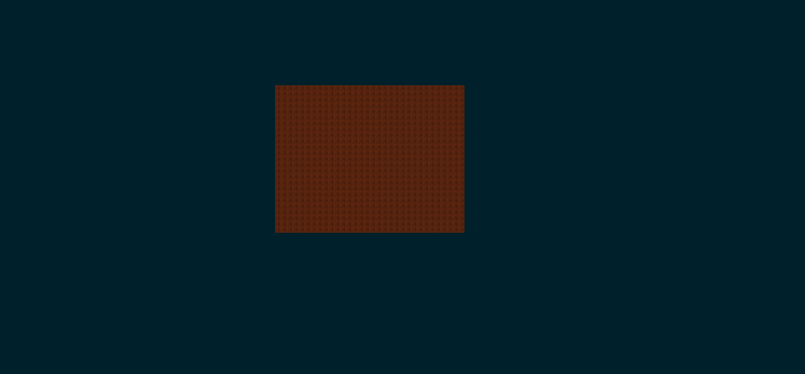
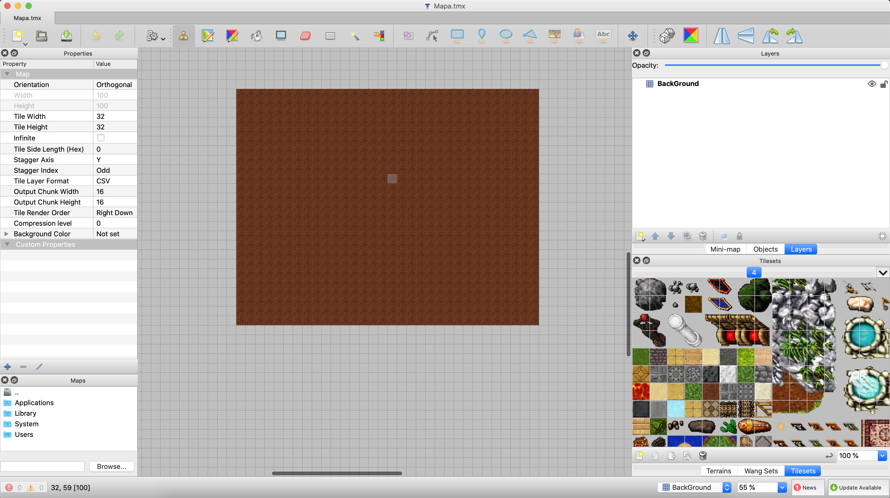

# Tiled y LibGDX

Ejemplo de uso de Tiled y LibGDX en Android. En el ejemplo se utiliza un mapa hecho por el programa tiled para la creación de mapas.

En la imagen siguiente se muestra el ejemplo corriendo en android:

En la imagen siguiente se muestra la aplicacion Tiled para la creacion de mapas.

